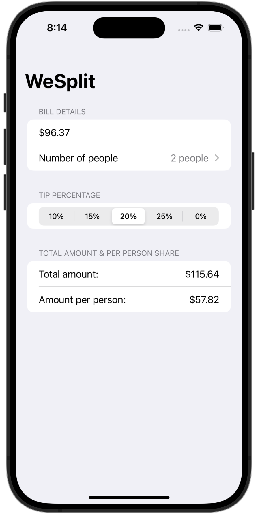

# WeSplit

WeSplit is a simple iOS application designed to help users split a check among a group of people. The app allows users to input the check amount, select the number of people, choose a tip percentage, and then calculates the total amount including the tip, as well as the amount each person needs to pay.

## Acknowledgments

- Heavily inspired by the "100 Days of SwiftUI" course by Paul Hudson.

## Screenshot



## Installation

1. Clone the repository:
    ```bash
    git clone https://github.com/yourusername/WeSplit.git
    ```
2. Open the project in Xcode:
    ```bash
    cd WeSplit
    open WeSplit.xcodeproj
    ```
3. Build and run the project using Xcode.

## Usage

1. Enter the check amount in the "Enter the check amount" text field.
2. Select the number of people using the "Number of People" picker.
3. Choose the desired tip percentage using the segmented control.
4. View the total amount and the amount per person in the "Total Amount & Per Person Share" section.
